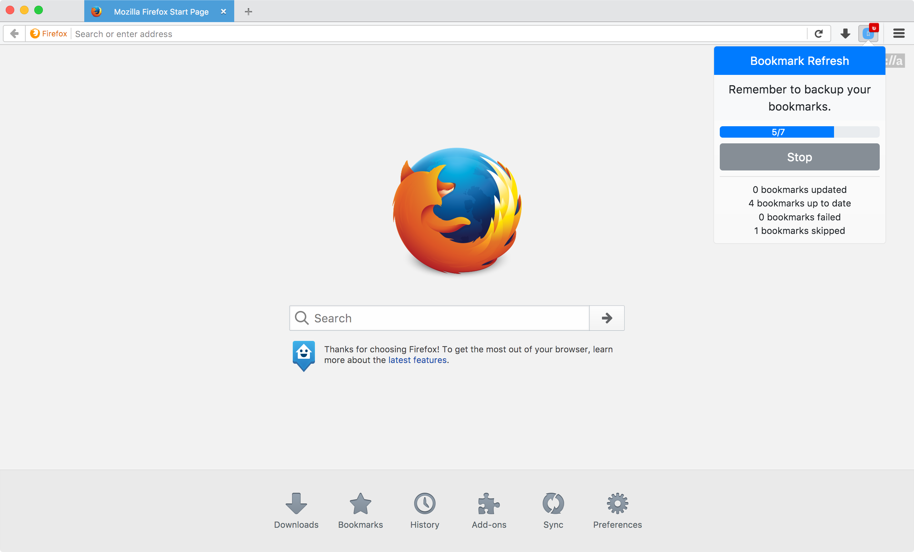

# Bookmark Refresh

> Update your bookmarks.

**Bookmark Refresh** lets you update your bookmarks [with website descriptions](#options). Useful when searching -- typing part of a website description recommends the bookmark.

Tested on Chrome 57+ and Firefox 51+.



Icon created by [IconDots](https://thenounproject.com/IconDots/) from the [Noun Project](https://thenounproject.com).

## Installation

To install **Bookmark Refresh**, download the [latest release](https://github.com/rwanyoike/bookmark-refresh/releases) and load it as an _unpacked_ (Chrome) or _temporary_ (Firefox) extension.

## Usage

> **Backup your bookmarks!**

Open the extenstion and click **Start**. It will proceed to load your bookmarks and start the update.

For example, this bookmark's page:

```html
<!DOCTYPE html>
<html>

<head>
  <title>GoatGoatYo</title>
  <meta name="description" content="GoatGoatYo is the search engine that
  tracks you. We don't protect your search history from anyone – even us!">
</head>

...
```

Will have its title set to: _GoatGoatYo_.

### Options

#### Append Website Description

When set, the above title becomes: _GoatGoatYo (GoatGoatYo is the search engine that tracks you. We don't protect your search history from anyone – even us!)_. 🐐

## Maintainers

- [@rwanyoike](https://github.com/rwanyoike)

## Contribute

Feel free to dive in. [Open an issue](https://github.com/rwanyoike/bookmark-refresh/issues/new) or submit a PR.

**Bookmark Refresh** follows the [Contributor Covenant](CODE_OF_CONDUCT.md) code of conduct.

## License

[MIT](LICENSE) © Raymond Wanyoike
